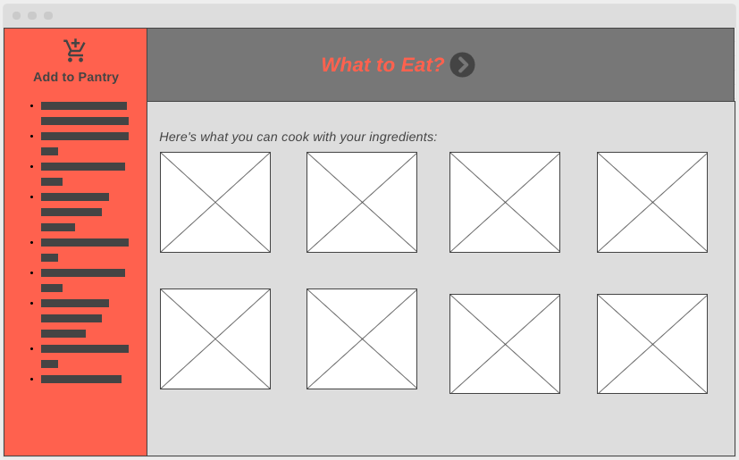
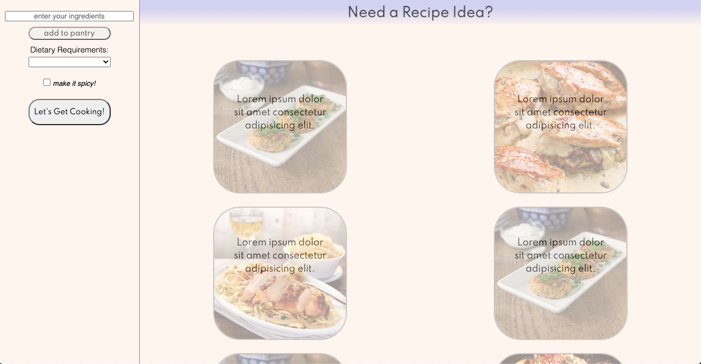
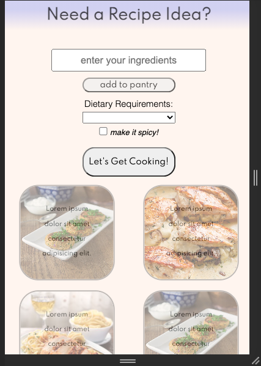

# Find Me a Recipe
A recipe application that uses the Recipe Puppy API. This recommends recipes based on what the user has in his or her “pantry”: a user-built list of on-hand ingredients. 

## Techonologies Used
The app runs off of AJAX .fetch requests to the Spoonacular API. Once a user inputs ingredients, the ingredients are picked up by the DOM and passed into a request URL to the API. The fetched data is parsed and used to create the images and titles.

The original API I was working with would also provide URL's to the recipe itself. To sidestep this issue, I used the incoming data to create a specific google search that usually provides the given recipe.

## Installation instructions

### required software:
In order to run this on your own machine, you will have to have and IDE that includes a text-editor with a live server. 

### downloading and running (command line)
1. Create a new directory and move into it: 
```mkdir <new-directory> && cd <new-directory>```
1. Clone the repo from github:
```git clone https://github.com/samleemcknight/recipe-api-dashboard.git```
1. Open the repo in your text editor
```open .``` or ``` atom . ``` or ``` code . ``` (depending on your text editor)
1. Run the live server

## User Stories
The most difficult thing for me about cooking is deciding what to cook. If I have all or most of the ingredients for a specific meal, I might search Google for recipes, but I otherwise tend to default to meals I'm comfortable with, and as a result see a lot of food go to waste.

I have often wanted an app that helps to prevent food waste. Furthermore, I find that forcing yourself to use all of your ingredients often makes you cook more interesting meals. 

At its current state, this app provides quick suggestions for meals based on the user's pantry.

The .fetch function will include three ingredients plus any dietary requirements. If the user, like me, wants almost every meal to be spicy, then a spicy search option can also be included in the parameters.

## Wireframes
At its simplest, I wanted the desktop view to be something like this:


For the sake of time, I kept this view roughly the same and did not greatly change it in order to give myself enough time to make a workable mobile view




## Eventuals 
There are a few things I would *eventually* like to do:

- Add a "search with all ingredients" option
- Include serving size and prep time
- Expand the number of dietary preferences
- *Eventually, eventually* I would like this to be a mobile-only app that will store users' ingredients in order to remind the user that certain ingredients might be going bad, and that those should be used soon.